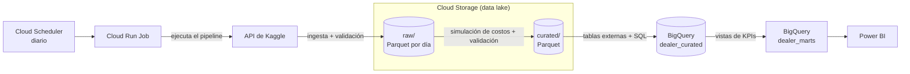
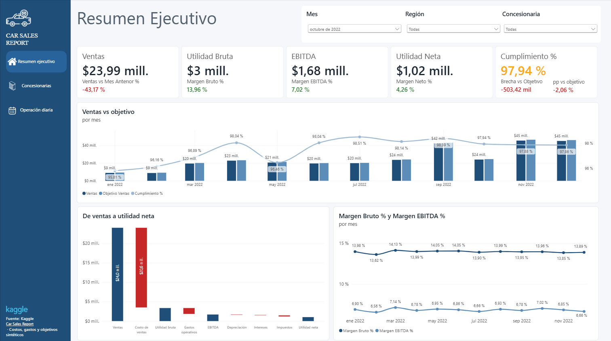
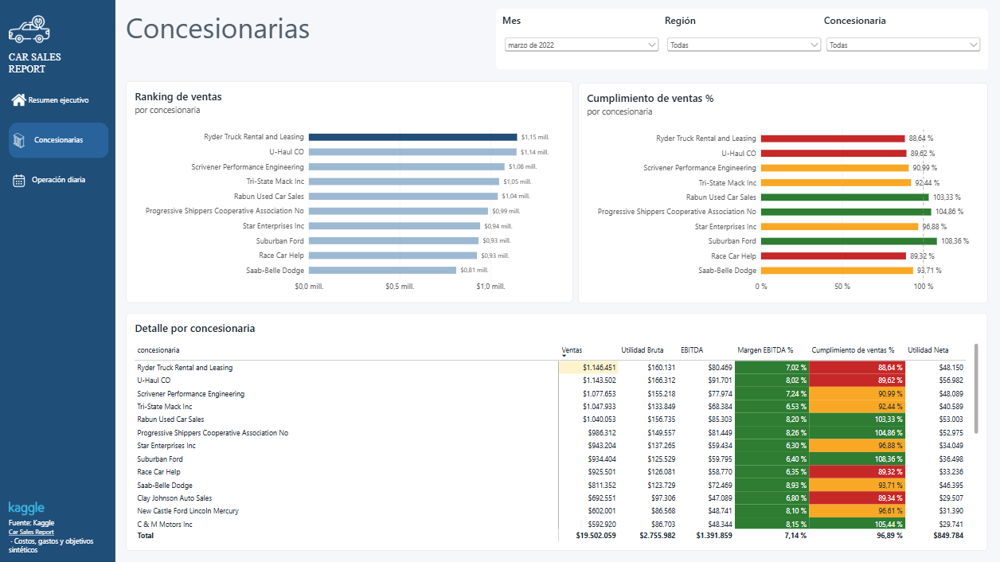
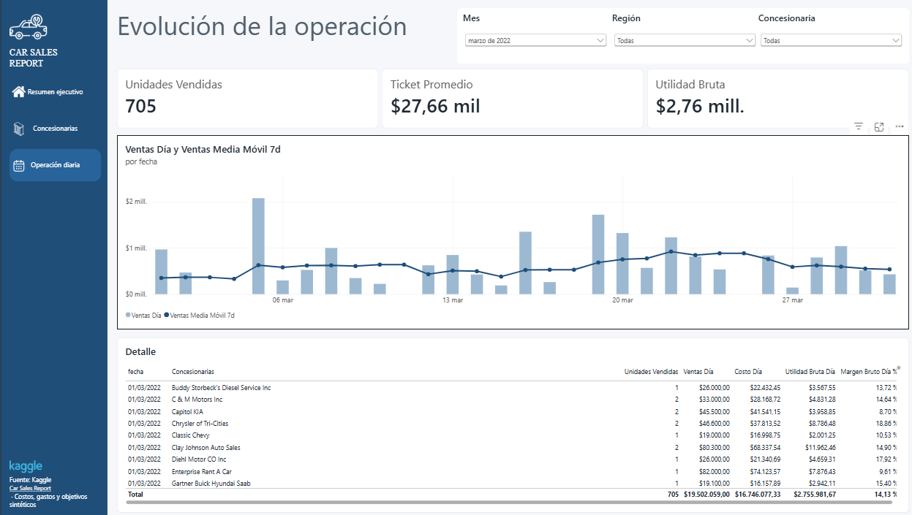
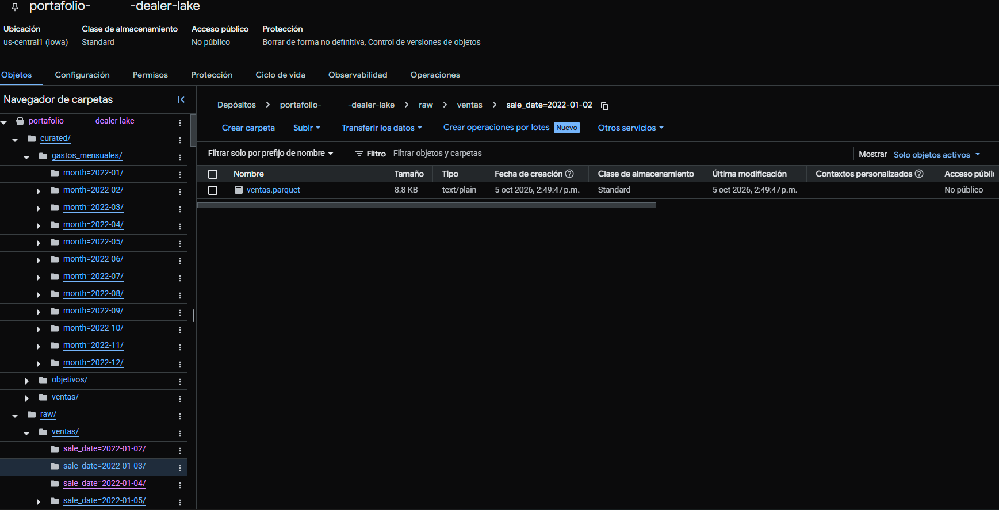
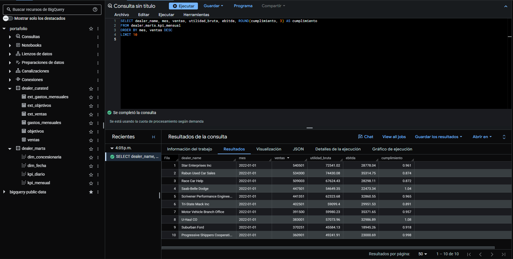
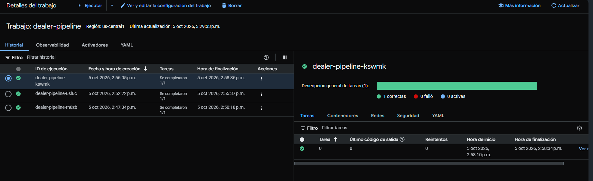
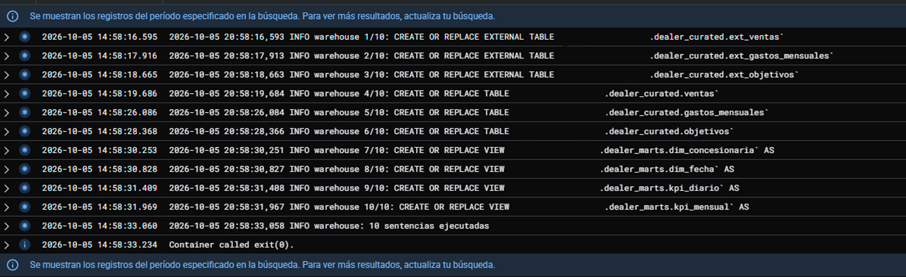
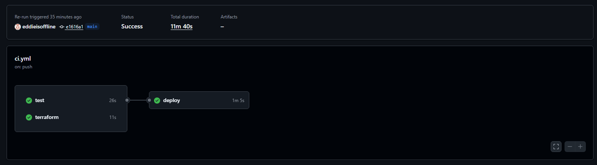

# auto-dealer-data-platform

Pipeline de datos en Google Cloud que convierte ventas de concesionarias en KPIs
financieros y operativos listos para Power BI: ingesta desde la API de Kaggle,
data lake en capas, warehouse en BigQuery, validaciones de calidad,
infraestructura como código y despliegue automático.

*English:* Google Cloud data pipeline that turns dealership sales into financial
and operational KPIs for Power BI: Kaggle API ingestion, layered data lake,
BigQuery warehouse, data quality checks, Terraform, and continuous deployment.
See the bilingual [case study](case-study.md).

> **Sobre los datos:** la fuente es un dataset público de Kaggle
> ([Car Sales Report](https://www.kaggle.com/datasets/missionjee/car-sales-report)),
> que es estático. Las cargas incrementales se **simulan** extrayendo un día de
> ventas por ejecución, para demostrar el diseño del pipeline. Costos, gastos y
> objetivos son **sintéticos** (semilla fija) y no representan datos reales. No se
> usa ningún dato de una empresa real.

## El problema

En muchas redes de concesionarias, los reportes de desempeño (ventas, utilidad
bruta, EBITDA y cumplimiento de objetivos por sucursal) suelen armarse a mano en
Excel, tardan semanas en cada cierre y llegan cuando ya no sirven para decidir.
Este proyecto muestra la alternativa: un flujo automático, reproducible y
verificable, de la fuente al tablero, con actualización diaria.

## Arquitectura



| Capa | Dónde | Contenido |
|------|-------|-----------|
| Fuente | API de Kaggle | ventas de un dataset público, sin datos personales desde la carga |
| `raw` | Cloud Storage | ventas validadas, un Parquet por día |
| `curated` | Cloud Storage | ventas con costo y utilidad bruta, más gastos y objetivos mensuales |
| Warehouse | BigQuery `dealer_curated` | tablas tipadas, `ventas` particionada por fecha |
| Consumo | BigQuery `dealer_marts` | dimensiones y vistas de KPIs para Power BI |

## Alcance técnico

- **Ingeniería de datos:** ingesta idempotente con backfill, Parquet particionado
  por día y por mes, capas raw y curated, ELT en BigQuery.
- **Calidad de datos:** validaciones entre capas que detienen el pipeline antes de
  propagar un lote defectuoso; los datos personales se eliminan en la carga.
- **Cloud y DevOps:** Terraform, Cloud Run Jobs, Cloud Scheduler, Secret Manager,
  Artifact Registry y GitHub Actions con Workload Identity Federation (sin llaves
  de larga duración).
- **Ingeniería de software:** funciones puras, almacenamiento intercambiable entre
  disco local y Cloud Storage, y 68 pruebas unitarias sin red ni credenciales.
- **Analítica:** modelo dimensional en BigQuery y modelo semántico en Power BI con
  KPIs financieros (utilidad bruta, EBITDA, utilidad neta, cumplimiento de objetivos).

## Decisiones de diseño

- **Idempotente de punta a punta:** cada ejecución sobrescribe su partición y cada
  sentencia de BigQuery es `CREATE OR REPLACE`. Correr dos veces el mismo día no
  duplica nada.
- **Simulación reproducible:** los valores sintéticos salen de un hash de su clave
  de negocio, no de un generador con estado. El orden o el tamaño del lote no
  cambian el resultado.
- **Mismo código en local y en la nube:** el almacenamiento tiene una interfaz
  común, así las pruebas locales cubren la lógica que corre en GCP.
- **Python mueve y valida, SQL transforma:** los KPIs viven en vistas de BigQuery,
  no en el código ni en el reporte.
- **Sin credenciales en el repositorio:** el token de Kaggle vive en Secret Manager
  y GitHub se autentica en GCP con un token OIDC limitado a este repo y a `main`.

Más detalle, variables de entorno y reglas de calidad en
[docs/arquitectura.md](docs/arquitectura.md).

## Stack

Python (pandas, pyarrow) · SQL (BigQuery) · Google Cloud (Cloud Storage, BigQuery,
Cloud Run Jobs, Cloud Scheduler, Secret Manager, Artifact Registry) · Terraform ·
Docker · GitHub Actions · Power BI

## Resultado

Carga histórica de 2022 ejecutada en Cloud Run: 10,645 ventas de 28
concesionarias en 292 días con ventas (los 73 días restantes no registran ventas
en la fuente). Tiempos por paso: backfill 2:12, curate 2:51 y warehouse 2:10
(min:s). Las validaciones no reportaron incidencias y raw y curated conservan las
mismas 10,645 filas. En CI/CD, cada push a `main` ejecuta pruebas y validación de
Terraform y despliega una imagen etiquetada con el SHA del commit. Las cifras
financieras son sintéticas.

### Power BI





El reporte se versiona como proyecto de Power BI en
[docs/powerbi/](docs/powerbi/): modelo semántico en TMDL (relaciones, consultas M y
42 medidas DAX en texto) y una copia `.pbix` con los datos importados. El modelo
está documentado en [docs/warehouse.md](docs/warehouse.md#modelo-semántico-power-bi).

### Plataforma en Google Cloud







## Ejecución local

```bash
pip install -e ".[dev,kaggle]"
pytest

export KAGGLE_API_TOKEN=<token>
python -m pipeline.cli backfill --start 2022-01-01 --end 2022-03-31
python -m pipeline.cli curate   --start 2022-01-01 --end 2022-03-31
```

Con el backend por defecto (`PIPELINE_BACKEND=local`), las capas se escriben en
`data/raw/` y `data/curated/`. `PIPELINE_SOURCE=file` sustituye la API de Kaggle
por el CSV indicado en `PIPELINE_SOURCE_CSV`, lo que permite ejecutar el pipeline
sin conexión.

## Estructura del repositorio

```
src/pipeline/
  kaggle_source.py   descarga del dataset desde la API de Kaggle
  ingest.py          carga, limpieza y partición raw por día
  simulate.py        costos, gastos y objetivos sintéticos (funciones puras)
  curate.py          raw -> curated
  validate.py        validaciones de calidad entre capas
  warehouse.py       refresco de BigQuery
  sql/               tablas externas, tablas nativas y vistas de KPIs
  storage.py         almacenamiento local o Cloud Storage
  daily.py, cli.py   ejecución diaria simulada y línea de comandos
tests/               pruebas unitarias
infra/terraform/     infraestructura como código
.github/workflows/   CI y despliegue
docs/                documentación técnica y capturas (img/)
docs/powerbi/        reporte de Power BI: proyecto PBIP (TMDL + PBIR) y copia .pbix
```

## Documentación

- [Caso de estudio (portafolio, ES/EN)](case-study.md)
- [Arquitectura y decisiones](docs/arquitectura.md)
- [Warehouse y modelo semántico](docs/warehouse.md)
- [Infraestructura y despliegue](docs/despliegue.md)

## Datos

Fuente: [Car Sales Report](https://www.kaggle.com/datasets/missionjee/car-sales-report)
en Kaggle (autor: missionjee). Licencia: la indicada en la página del dataset.
